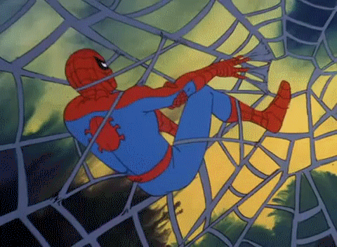
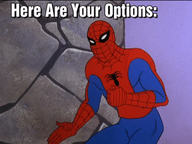

# Parker.js

**Make things sticky**

Hey web slingers! Parker.js is a small script for making elements sticky.



Parker.js lets you target a given element and will make it stick in place once the bottom of that element scrolls into view. It will unstick it, allowing it to continue scrolling normally, once the bottom of its parent element scrolls to the position of the bottom of the sticky element. The same is true of the tops of the elements when scrolling up.


### Installing
Install parker.js with [Yarn](http://yarnpkg.com)

```
yarn add parker.js
```

and import the parker module

```
import parker from "parker.js"
```

## Usage
Kick off parker.js with it's `init` method:  
```
parker.init(selector, options)
```

Parker.js takes a selector of the element that is to be make sticky. If parker cannot find an element that matches the selector it will fail silently. If there are multiple elements that match the given selector it will just use the first one.

In addition to the selector, parker.js accepts an options object which can include the following options:

### Options:


**parentSelector**:
The sticky element will stay in place until the top or bottom of the parent element touches the top or bottom of the sticky element. By default parker.js can infer the parent of the element that is being made sticky. If, however, you would prefer to treat a grandparent or an element higher up the stack as the parent you can set a selector here to have the sticky element remain in place until that element touches the top or bottom of the sticky element.

Using sibling or a different element within which the sticky element is not contained, can cause some… _interesting_ behavior.

**breakpointStart**
It doesn't typically make sense to make elements sticky at narrow breakpoints. By default, elements will retain standard behavior until the window is wider than 768px. If you'd like to change this you can pass the value of the desired width in pixels.

**bottomMargin**
By default parker.js does not add any margin between the sticky element and the parent. A pixel value can be set here to provide some buffer between the bottom of the sticky element and the bottom of the parent element.

**widthReferenceSelector**
By default parker.js keep the sticky element as wide as it is on the initial page load. For responsive or variable width elements, this can cause some weirdness if and when the browser is resized. To solve this issue, parker.js can take a selector of a different element on the page and use its width for the sticky element's width as the window size changes.

### Examples:
```
parker.init('.parker', {
  parentSelector: '.parker-parent',
  breakpointStart: 800,
  bottomMargin: 50
});
```
